Absolutely, João — here are **Mermaid flowcharts** for every major feature in your ABOR tutorial app. They’re clean, copy‑paste ready, and structured so you can drop them directly into Markdown, GitHub, Notion, or documentation.

I’ll break them down by module so you can keep everything organized.

---

# 📊 **1. Dashboard — Mermaid Diagram**

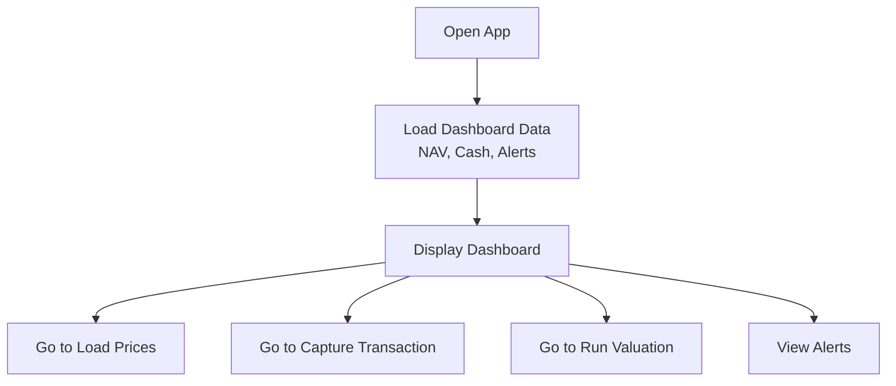
---

# 📁 **2. Funds**

## **2.1 Fund List**

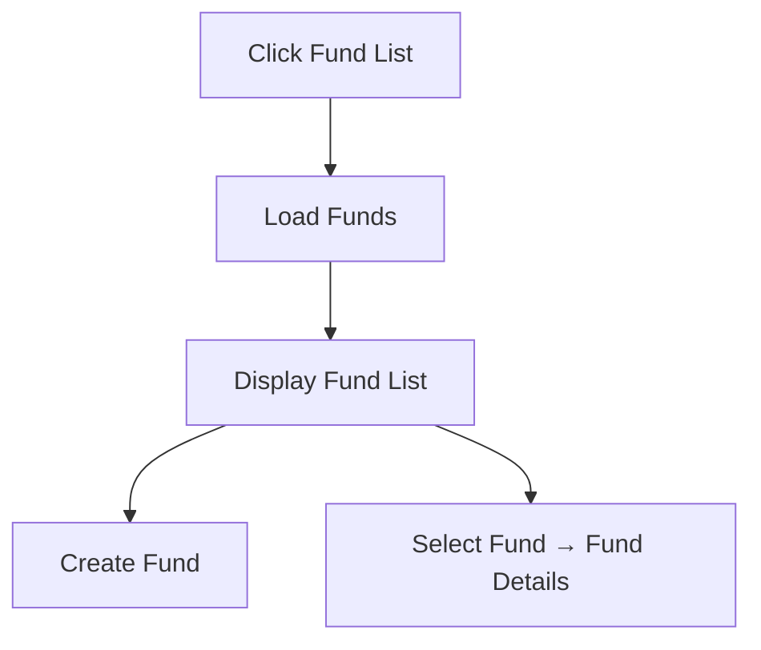

---

## **2.2 Create Fund**

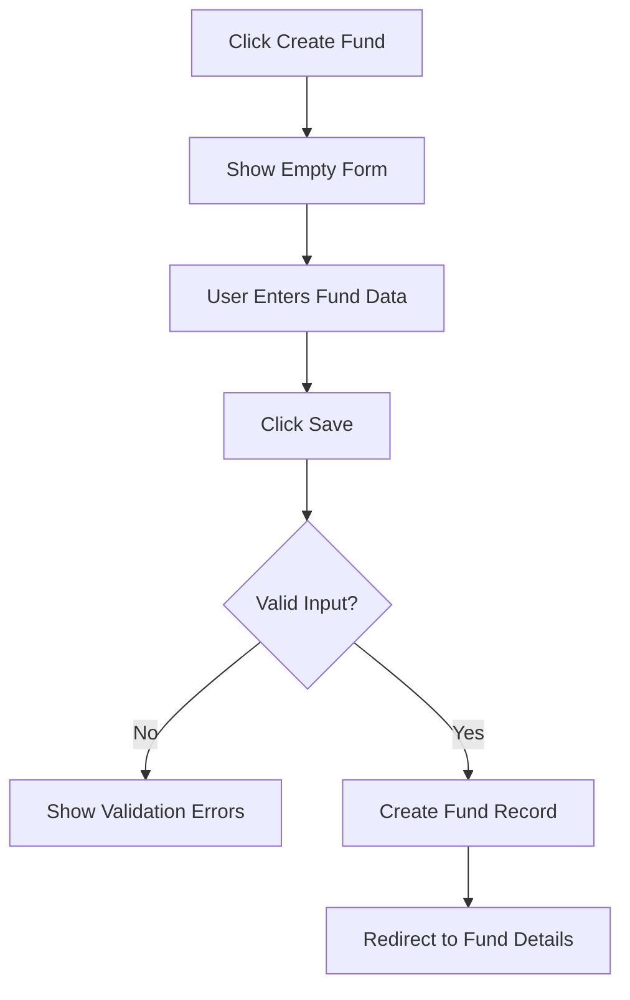

---

## **2.3 Fund Details**

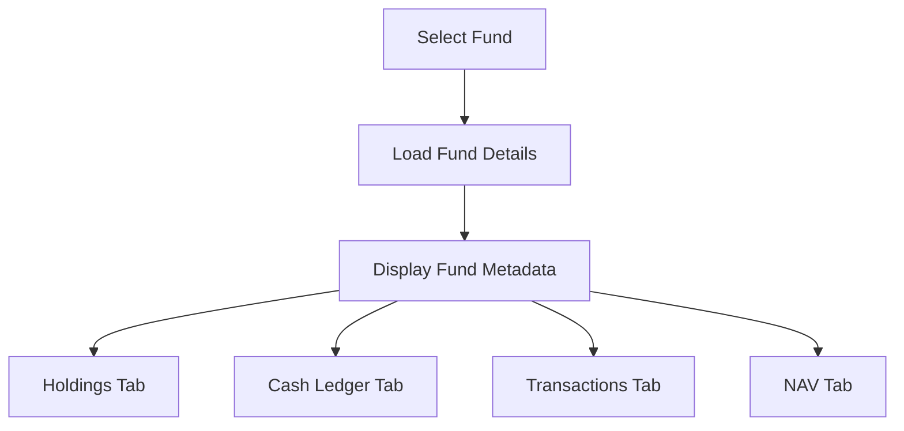

---

# 💼 **3. Portfolio**

## **3.1 Holdings**

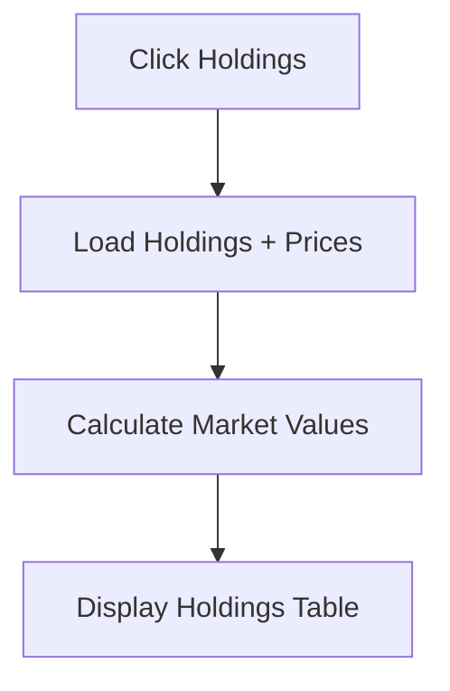

---

## **3.2 Cash Ledger**

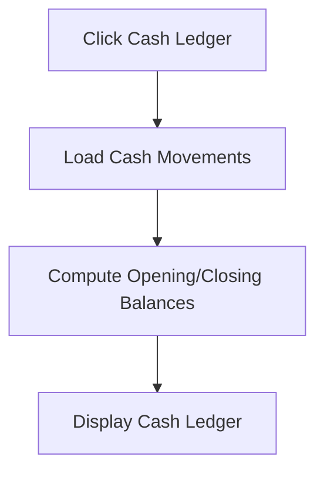

---

# 🔁 **4. Transactions**

## **4.1 Capture Transaction**

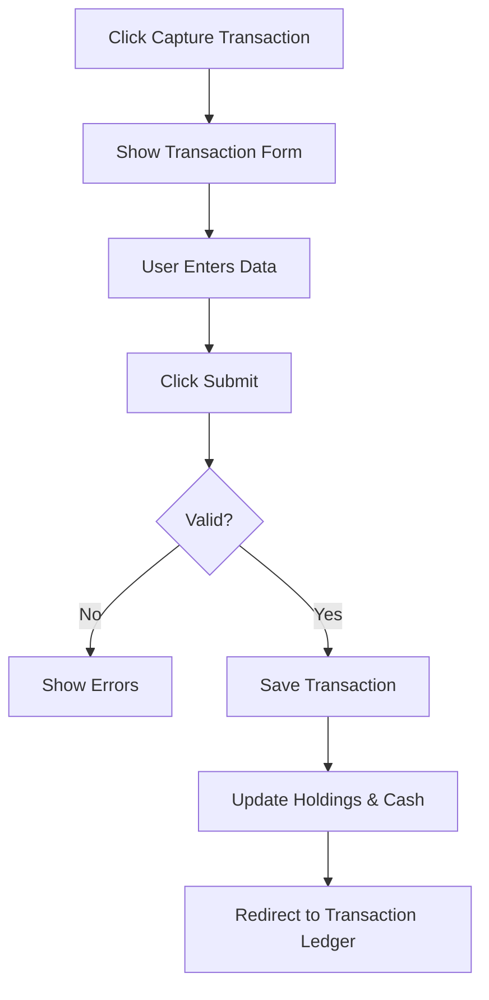

---

## **4.2 Transaction Ledger**

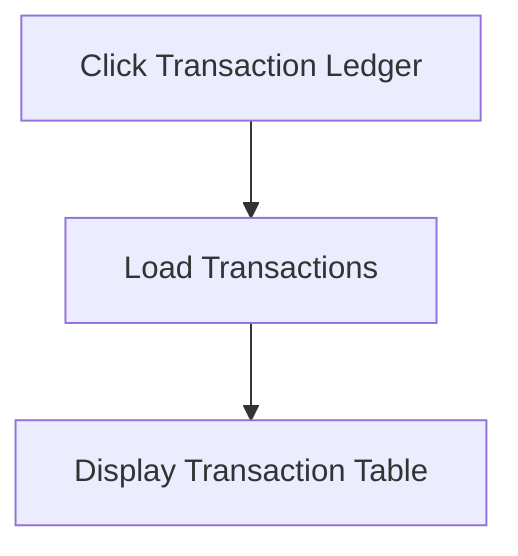

---

# 💵 **5. Pricing & Valuation**

## **5.1 Load Prices**

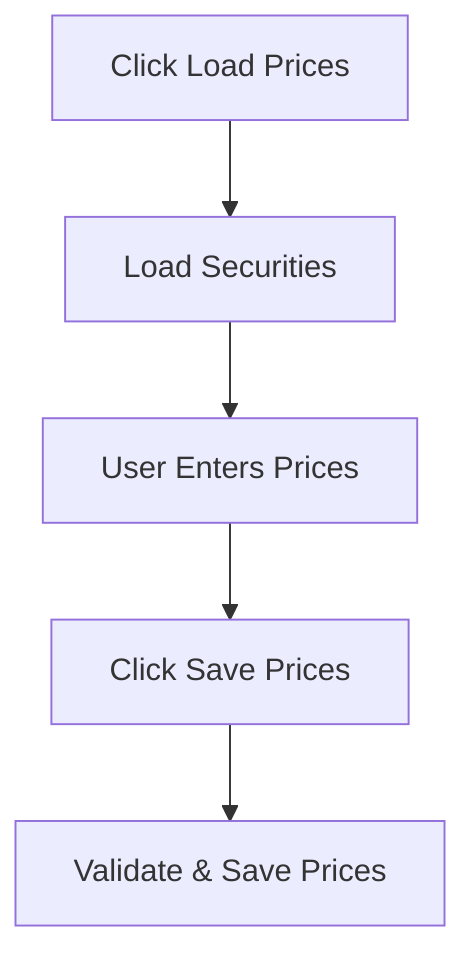

---

## **5.2 Run Valuation**

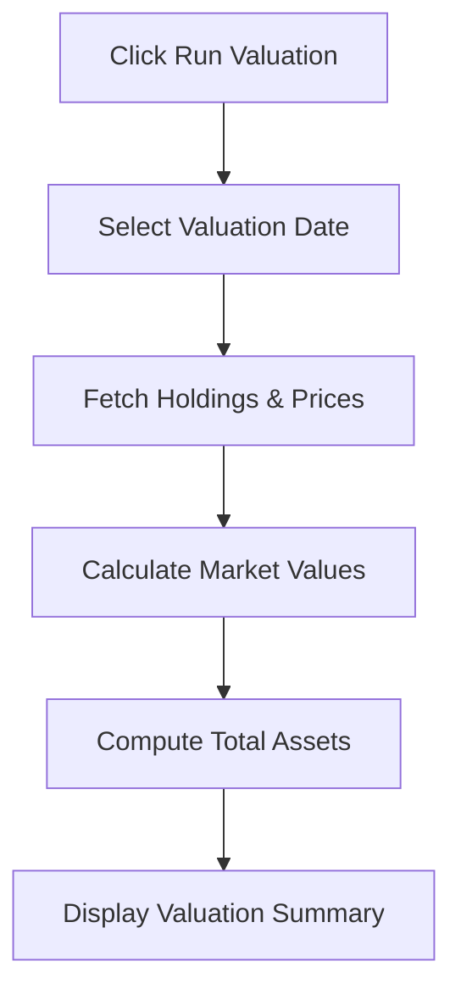

---

# 🧮 **6. NAV**

## **6.1 Calculate NAV**

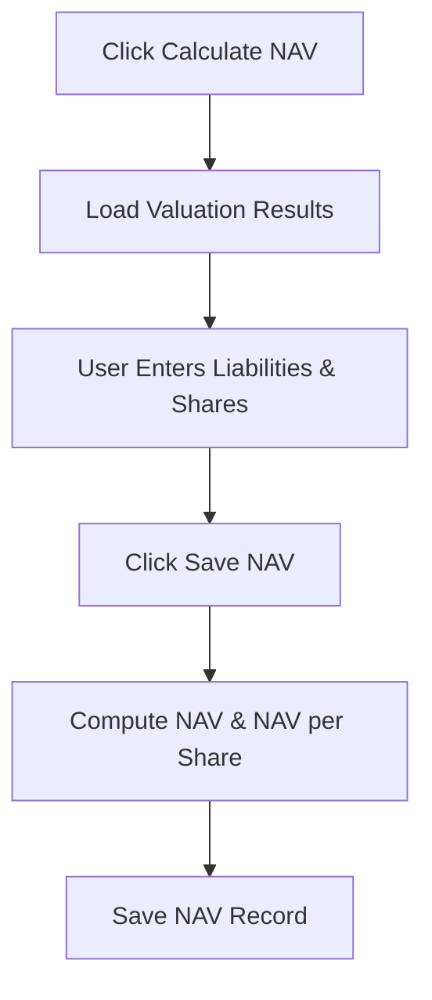

---

## **6.2 NAV History**

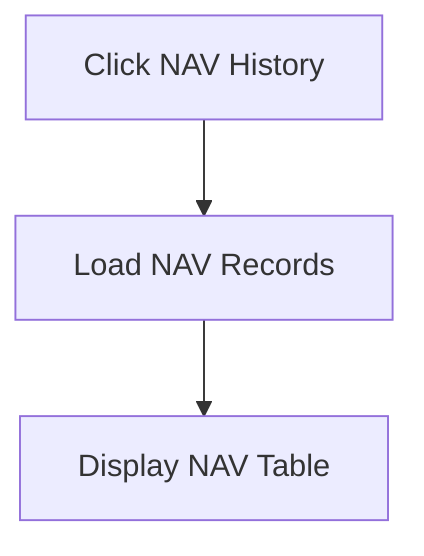

---

# 📄 **7. Reports**

## **7.1 Holdings Report**

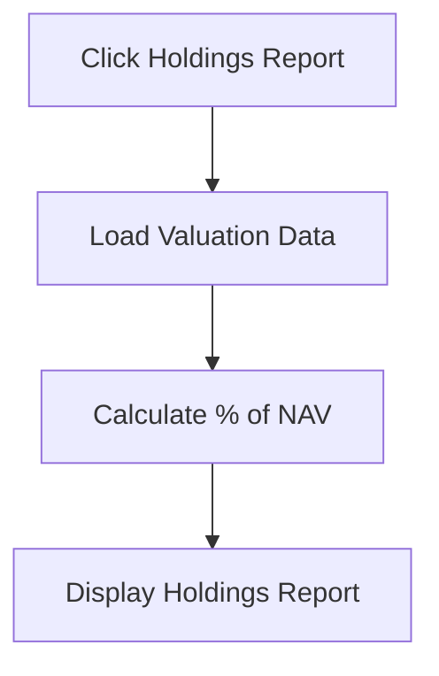

---

## **7.2 Cash Report**

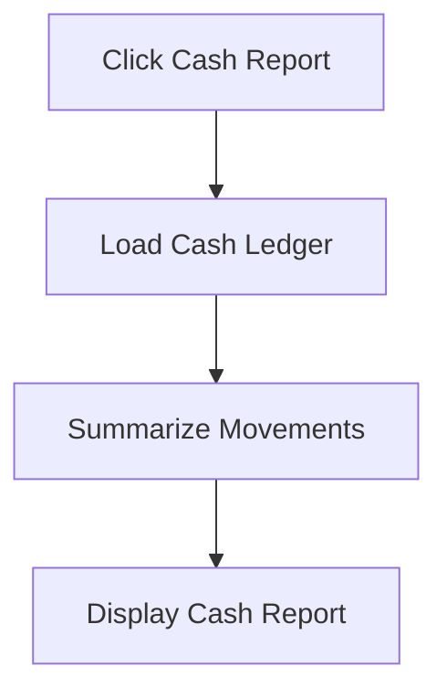

---

## **7.3 NAV Report**

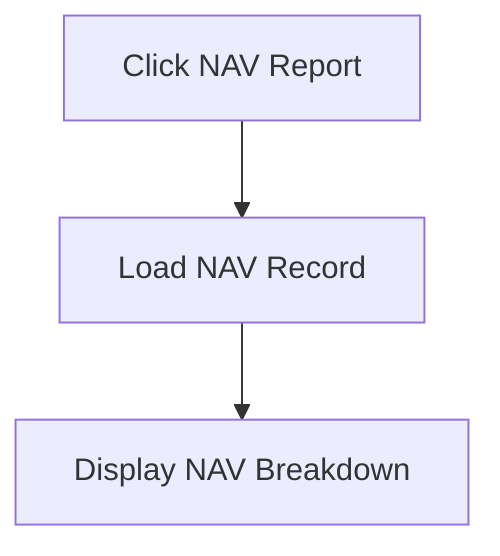

---

# ⚙️ **8. Admin / Reference Data**

## **8.1 Securities**

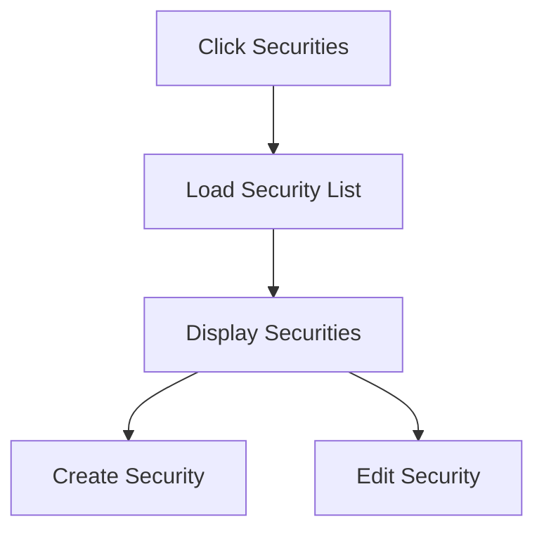

---

## **8.2 Create Security**

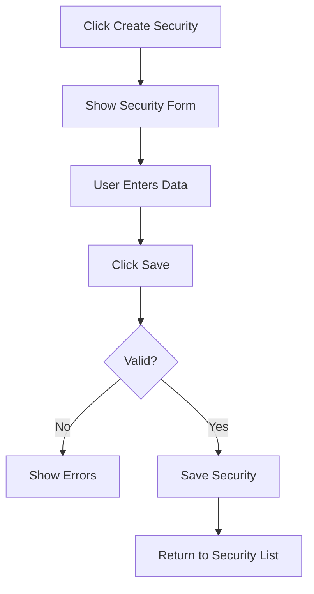

---

# 🎯 Want the next layer?

I can also generate:

- **Mermaid sequence diagrams** (system interactions)
- **Mermaid ERD diagrams** (database schema)
- **Mermaid class diagrams** (domain model)
- **Mermaid user journey maps**
- **A full Mermaid architecture diagram**

Just tell me what you want to visualize next.
