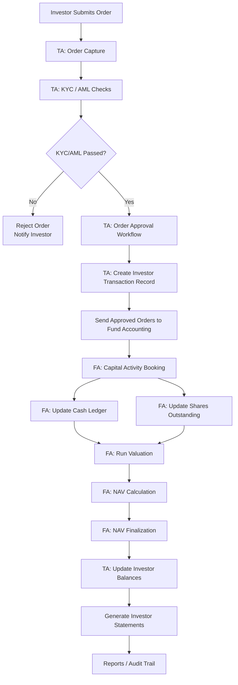

```mermaid
flowchart TD
    A[Investor Submits Order] --> B[TA: Order Capture]

    B --> C[TA: KYC / AML Checks]
    C --> D{KYC/AML Passed?}

    D -- No --> E[Reject Order<br>Notify Investor]
    D -- Yes --> F[TA: Order Approval Workflow]

    F --> G[TA: Create Investor Transaction Record]
    G --> H[Send Approved Orders to Fund Accounting]

    H --> I[FA: Capital Activity Booking]
    I --> J[FA: Update Cash Ledger]
    I --> K[FA: Update Shares Outstanding]

    J --> L[FA: Run Valuation]
    K --> L

    L --> M[FA: NAV Calculation]
    M --> N[FA: NAV Finalization]

    N --> O[TA: Update Investor Balances]
    O --> P[Generate Investor Statements]

    P --> Q[Reports / Audit Trail]
```
